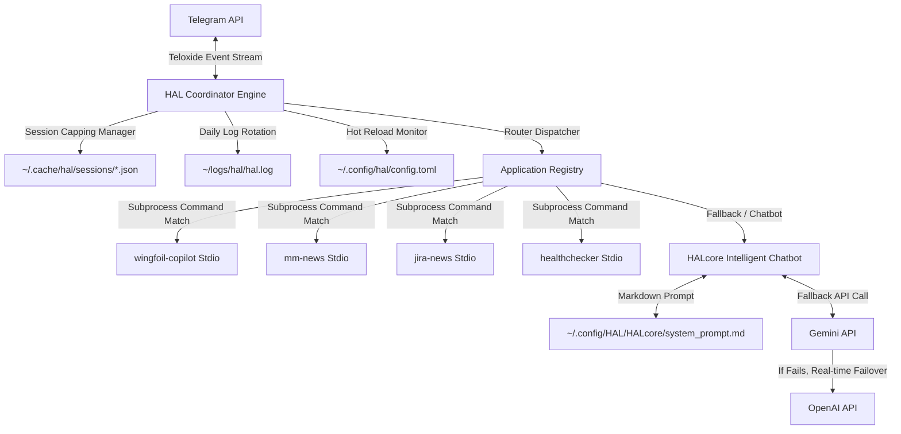

# 🤖 HAL Ecosystem: Asynchronous Telegram Coordination Platform

Welcome to the **HAL Ecosystem** monorepo workspace. This repository contains the complete, production-grade, highly cohesive suite of Rust applications that form the HAL coordination network.

---

## 🏛️ Ecosystem Architecture Overview

The system is designed around a decoupled, decentralized architecture. A single, persistent orchestrator (**HAL**) manages the Telegram API connection, handles user sessions, manages dynamic progress updates, and acts as a central router. The business logic is isolated into highly focused **Specialized Applications** and an intelligent fallback companion (**HALcore**) which are spawned **on-demand as lightweight subprocesses** over standard input/output (`stdin`/`stdout`).



---

## 📦 Workspace Component Directories

This workspace consists of **5 main packages** defined in the [HAL_ecosystem.code-workspace](HAL_ecosystem.code-workspace) definition:

### 1. [🔴 HAL](./HAL) (Main Coordinator Bot)
* **Description**: The asynchronous front-end engine that manages Telegram connectivity via Teloxide, handles individual user session histories, coordinates live percent-completed progress updates, and formats results.
* **Technology**: Rust (Tokio, Teloxide, serde).
* **Transport**: Supports dynamic stdio subprocess pipes and HTTP streams.

### 2. [🧠 HALcore](./HAL/HALcore) (Conversational Fallback Chatbot)
* **Description**: Spawns on-demand to handle conversational messages or unregistered commands. Features dynamic roleplaying (roleplays as a calm, ultra-polite, slightly eerie computer system inspired by *2001: A Space Odyssey*) and real-time **LLM high-availability failover** (Gemini $\rightarrow$ OpenAI $\rightarrow$ local offline string matching).
* **Technology**: Rust, Google Gemini API, OpenAI API.

### 3. [🏄 Wingfoil Copilot](./wingfoil-copilot) (Weather Analytics & surfer Copilot)
* **Description**: Pulls current weather from Holfuy (using a headless browser and regex) and forecasts from MeteoConsult (bypassing anti-bot checks). Applies real-time forecast corrections and uses an LLM to generate premium surfer recommendations for the Baie de Lancieux.
* **Technology**: Rust, Playwright/Chromium, Tesseract OCR, OpenAI.

### 4. [💬 Mattermost News (`mm-news`)](./mm-news) (Workspace Digest Reporter)
* **Description**: Logs into Mattermost, aggregates recent channel discussions, and uses Gemini to generate a highly focused daily news feed summary of active channels.
* **Technology**: Rust, Mattermost REST API, Gemini API, daily rolling logs.

### 5. [🎫 JIRA News (`jira-news`)](./jira-news) (Issue Tracker Summary Feed)
* **Description**: Queries JIRA using modern `/rest/api/3/search/jql` endpoints. Natively parses nested Atlassian Document Format (ADF) blocks and comments. Synthesizes JQL filters into a formatted HTML digest using Gemini.
* **Technology**: Rust, JIRA REST API v3, Bearer & Basic auth, Gemini API.

### 6. [🖥️ Healthchecker](./healthchecker) (System Metrics & Health Monitor)
* **Description**: Profiles system health on-demand: `/system` (CPU/RAM/Disk metrics), `/healthcheck` (pings and validates all HAL registered apps), and `/logs` (gathers and highlights warnings in central logs). Generates AI-assisted health diagnostics.
* **Technology**: Rust, `/proc` virtual files system interface, OpenAI.

---

## 🔌 The HAL application Integration Protocol

Applications communicate with HAL over standard input/output using a strict **Line-Delimited JSON (NDJSON)** structure:

1. **Request**: HAL pipes a single JSON line into the subprocess's `stdin` on startup:
   ```json
   {"request_id":"550e8400-e29b-41d4-a716-446655440000","command":"jira6h","arguments":[]}
   ```

2. **Progress Updates**: The application streams live progress strings followed by a newline `\n` to `stdout`:
   ```json
   {"type":"progress","request_id":"...","percent":45,"message":"Connecting to JIRA API...","format":"html"}
   ```

3. **Final Response**: Once complete, the application writes the final styled HTML output to `stdout` and exits:
   ```json
   {"type":"final","request_id":"...","format":"html","message":"<b>📄 Recent JIRA Updates:</b>...","trusted_html":true}
   ```

4. **Error Handling**: If a failure occurs, the application writes an error structure and exits:
   ```json
   {"type":"error","request_id":"...","reason":"API Timeout","technical_details":"...","suggested_action":"Please check JIRA connectivity."}
   ```

---

## 🚀 How to Compile and Install the Ecosystem

### 1. Prerequisites
Install dependencies (Tesseract and Chromium are required for `wingfoil-copilot`'s headless weather scraping):
```bash
sudo apt update
sudo apt install -y tesseract-ocr chromium chromium-driver build-essential libssl-dev pkg-config
```

### 2. Compilation
Compile all workspace members in optimized release mode inside the monorepo root:
```bash
cargo build --release --workspace
```

### 3. Deploy
Create your local execution folder and deploy all compiled binaries:
```bash
mkdir -p ~/bin
cp target/release/hal ~/bin/
cp target/release/halcore ~/bin/
cp target/release/wingfoil-copilot ~/bin/
cp target/release/mm-news ~/bin/
cp target/release/jira-news ~/bin/
cp target/release/healthchecker ~/bin/
chmod +x ~/bin/*
```

---

## ⚙️ Shared Configuration System

All applications look for configurations in standard XDG home paths. Copy the templates and configure your private API keys (never commit these!):

* **HAL Coordinator**: `~/.config/hal/config.toml` (auto hot-reloaded on updates!)
* **HALcore Chatbot**: `~/.config/HAL/HALcore/config.toml` & `system_prompt.md`
* **Wingfoil Copilot**: `~/.config/wingfoil-copilot/config.toml`
* **Mattermost News**: `~/.config/mm-news/config.toml`
* **JIRA News**: `~/.config/jira-news/config.toml`
* **Healthchecker**: `~/.config/healthchecker/config.toml`

---

## 📄 License & Copyright

Copyright (c) 2026 Cedric Gegout. All rights reserved.
Licensed under the [MIT License](HAL/LICENSE).
